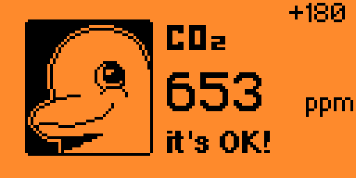
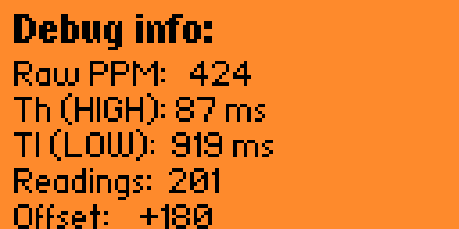
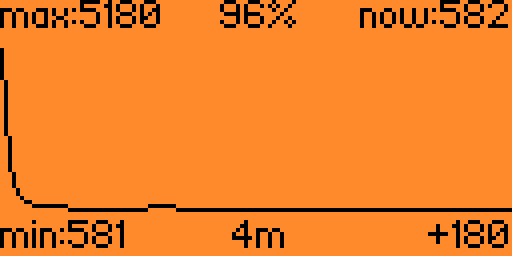
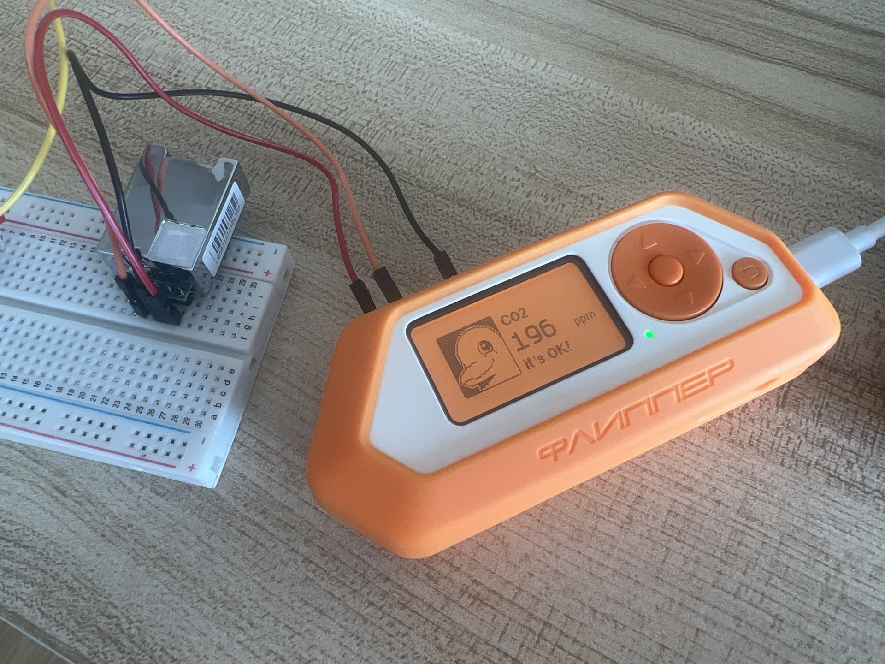

# CO2 Detector MH-Z19 for Flipper Zero

Flipper Zero application for measuring CO2 concentration using the MH-Z19 sensor via PWM.

Forked from [meshchaninov/flipper-zero-mh-z19](https://github.com/meshchaninov/flipper-zero-mh-z19) and significantly improved.







## What's changed from the original

The original [meshchaninov/flipper-zero-mh-z19](https://github.com/meshchaninov/flipper-zero-mh-z19) had unstable readings that jumped erratically, a single measurement screen, and range switching (2000/5000) that most users don't need.

This fork is a complete rewrite of the core logic:

| | Original | This fork |
|---|---|---|
| Readings | Raw PWM, jumping ±50 ppm | 4-stage filter (median + EMA), stable ±1-2 ppm |
| GPIO polling | ~100 ms (caused value freezing) | 1 ms (accurate PWM capture) |
| Screens | 1 measurement screen | 5 screens: connect, calibrate, measure, debug, graph |
| Calibration | None | Adjustable offset ±500 ppm |
| History | None | 128-point graph with auto-compression (10 min — 11 hours) |
| Range | Switchable 2000/5000 | Hardcoded 5000 (matches most MH-Z19 sensors) |
| Alerts | Basic LED | LED + vibro with hysteresis to prevent flickering |

## Features

- **Stable readings** — 4-stage filter pipeline: validation, median (8 samples), EMA smoothing, status hysteresis
- **Fast PWM polling** — 1 ms GPIO sampling for accurate pulse width measurement
- **Calibration offset** — adjustable offset (±500 ppm, step 5) to match a reference sensor
- **CO2 history graph** — real-time line chart with auto-scaling time axis (10 min to 11+ hours)
- **Debug screen** — raw PWM values, timing, and reading count
- **LED + vibro alerts** — green/yellow/red status based on 800/1000 ppm thresholds with hysteresis

## Screens

| Screen | Description | Navigation |
|--------|-------------|------------|
| Connect | Wiring instructions | OK → next |
| Calibrate | Adjust PPM offset with ←→ | OK → next |
| Measure | CO2 value, status icon, offset | ↑ debug, → graph |
| Debug | Raw PPM, Th/Tl timing, readings count | ↓ back |
| Graph | CO2 history chart with thresholds | ← back |

## Wiring

```
MH-Z19       Flipper Zero
───────      ────────────
5V      ──►  5V  (pin 1)
GND     ──►  GND (pin 8)
PWM     ──►  A6  (pin 3)
```



## Installation

### Option 1: Download .fap (recommended)

1. Download `mh_z19.fap` from [Releases](../../releases)
2. Copy to Flipper Zero SD card: `apps/GPIO/mh_z19.fap`
3. Open: Applications → GPIO → CO2 detector MH-Z19

### Option 2: Build from source

```bash
# Clone this repo
git clone https://github.com/razerhome/flipper-zero-co2-mh-z19.git

# Clone Flipper Zero firmware
git clone --recursive https://github.com/flipperdevices/flipperzero-firmware.git

# Copy app to firmware
mkdir -p flipperzero-firmware/applications_user/mh_z19
cp flipper-zero-co2-mh-z19/* flipperzero-firmware/applications_user/mh_z19/

# Build
cd flipperzero-firmware
./fbt fap_mh_z19
```

The compiled `.fap` will be in `build/f7-firmware-D/.extapps/mh_z19.fap`.

## How the graph works

The graph stores 128 data points. Recording starts at 5-second intervals. When the buffer is full, it compresses by averaging pairs of points and doubling the interval. This way 128 points can cover from ~10 minutes up to 11+ hours of monitoring.

| Interval | Buffer covers |
|----------|--------------|
| 5 sec | ~10 min |
| 10 sec | ~21 min |
| 20 sec | ~42 min |
| 40 sec | ~1.4 hours |
| 80 sec | ~2.8 hours |
| 160 sec | ~5.7 hours |
| 320 sec | ~11.4 hours |

## License

MIT License. See [LICENSE](LICENSE).

Based on original work by [Nikita Meshchaninov](https://github.com/meshchaninov).
